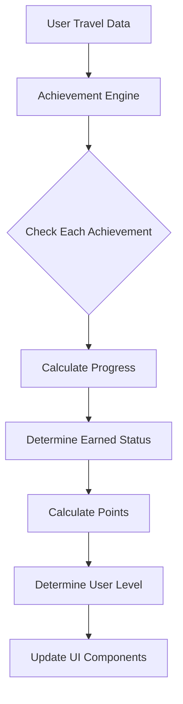

# DINO Achievement System Documentation

## Table of Contents
1. [Overview](#overview)
2. [Achievement Categories](#achievement-categories)
3. [Points & Rarity System](#points--rarity-system)
4. [User Levels](#user-levels)
5. [Complete Achievement List](#complete-achievement-list)
6. [Technical Implementation](#technical-implementation)
7. [UI/UX Components](#uiux-components)
8. [Future Enhancements](#future-enhancements)

---

## Overview

The DINO Achievement System is a gamification feature designed to motivate and reward travelers for reaching various milestones in their journey. It tracks user progress across multiple dimensions of travel and provides visual feedback through badges, points, and level progression.

### Core Features
- **20+ Unique Achievements** across 5 categories
- **4 Rarity Tiers** with distinct visual styles
- **Points-Based Progression** from 10 to 250 points per achievement
- **7 User Levels** from Beginner to Master Nomad
- **Real-time Progress Tracking** with percentage indicators
- **Smart Recommendations** for next achievable milestones

### Design Philosophy
- **Accessibility First**: Early achievements are easily attainable to engage new users
- **Multiple Paths**: Users can progress through different travel styles (frequent short trips vs. long stays)
- **Long-term Engagement**: Legendary achievements provide aspirational goals
- **Visual Motivation**: Progress bars and percentages create tangible goals

---

## Achievement Categories

### 1. 🌍 **Countries** - Geographic Exploration
Rewards visiting different countries, encouraging geographic diversity in travel.

### 2. 🏙️ **Cities** - Urban Discovery  
Celebrates exploring different cities within countries, promoting deeper exploration.

### 3. 📅 **Days** - Travel Duration
Recognizes total time spent traveling, from weekend trips to full-time nomadism.

### 4. 🎯 **Milestones** - Special Accomplishments
Marks significant travel patterns and behaviors like return visits or continent hopping.

### 5. ⭐ **Special** - Unique Travel Styles
Acknowledges specific travel patterns like digital nomadism or regional expertise.

---

## Points & Rarity System

### Rarity Tiers

| Rarity | Color | Point Range | Difficulty | Visual Style |
|--------|-------|-------------|------------|--------------|
| **Common** | Gray | 10-25 | Easy - Most users will achieve | `bg-gray-100 border-gray-300` |
| **Rare** | Blue | 30-50 | Moderate - Regular travelers | `bg-blue-100 border-blue-300` |
| **Epic** | Purple | 60-100 | Hard - Dedicated travelers | `bg-purple-100 border-purple-300` |
| **Legendary** | Gold | 150-250 | Exceptional - Elite achievement | `bg-yellow-100 border-yellow-300` |

### Points Distribution Logic

```
Points = Base Value × Difficulty Multiplier × Rarity Bonus

Where:
- Base Value: 10 points
- Difficulty Multiplier: 1.0 - 5.0 based on effort required
- Rarity Bonus: 1.0 (Common), 1.5 (Rare), 2.0 (Epic), 5.0 (Legendary)
```

### Point Calculation Examples
- **First Country** (Common): 10 × 1.0 × 1.0 = 10 points
- **10 Countries** (Rare): 10 × 3.3 × 1.5 = 50 points  
- **3 Continents** (Epic): 10 × 3.0 × 2.0 = 60 points
- **50 Countries** (Legendary): 10 × 5.0 × 5.0 = 250 points

---

## User Levels

### Level Progression Table

| Level | Points Required | Title | Description |
|-------|----------------|-------|-------------|
| 1 | 0-24 | **Beginner** | Just starting your travel journey |
| 2 | 25-49 | **Traveler** | Building travel experience |
| 3 | 50-99 | **Explorer** | Actively discovering the world |
| 4 | 100-249 | **Adventurer** | Seasoned travel enthusiast |
| 5 | 250-499 | **Seasoned Explorer** | Extensive travel experience |
| 6 | 500-999 | **Expert Traveler** | Master of international travel |
| 7 | 1000+ | **Master Nomad** | Elite world traveler |

### Level Benefits (Future Implementation)
- **Visual Badges**: Unique level indicators on profile
- **Leaderboards**: Compare with other travelers at your level
- **Unlock Features**: Advanced features for higher levels
- **Community Recognition**: Special flair in community features

---

## Complete Achievement List

### 🌍 Countries Category

| Achievement | Requirement | Points | Rarity | Icon |
|------------|-------------|--------|--------|------|
| **First Steps** | Visit 1 country | 10 | Common | 🎯 |
| **Explorer** | Visit 5 countries | 25 | Common | 🗺️ |
| **Wanderer** | Visit 10 countries | 50 | Rare | 🌍 |
| **Globe Trotter** | Visit 20 countries | 100 | Epic | 🌎 |
| **World Citizen** | Visit 50 countries | 250 | Legendary | 🌐 |

### 🏙️ Cities Category

| Achievement | Requirement | Points | Rarity | Icon |
|------------|-------------|--------|--------|------|
| **City Hopper** | Visit 10 cities | 20 | Common | 🏙️ |
| **Urban Explorer** | Visit 25 cities | 40 | Rare | 🌆 |
| **Metropolitan Master** | Visit 50 cities | 80 | Epic | 🏛️ |

### 📅 Days Traveled Category

| Achievement | Requirement | Points | Rarity | Icon |
|------------|-------------|--------|--------|------|
| **Month Abroad** | 30 total days | 15 | Common | 📅 |
| **Season Traveler** | 90 total days | 35 | Rare | 🗓️ |
| **Half-Year Nomad** | 180 total days | 75 | Epic | ⏰ |
| **Perpetual Traveler** | 365 total days | 150 | Legendary | 🎊 |

### 🎯 Milestones Category

| Achievement | Requirement | Points | Rarity | Icon |
|------------|-------------|--------|--------|------|
| **Slow Traveler** | 30+ days in one stay | 30 | Rare | 🏡 |
| **Return Visitor** | Visit same country 3+ times | 20 | Common | 🔄 |
| **Frequent Flyer** | Complete 10+ trips | 40 | Rare | ✈️ |
| **Continent Hopper** | Visit 3+ continents | 60 | Epic | 🗾 |

### ⭐ Special Category

| Achievement | Requirement | Points | Rarity | Icon |
|------------|-------------|--------|--------|------|
| **Asia Expert** | Visit 5+ Asian countries | 45 | Rare | 🏯 |
| **Europe Explorer** | Visit 5+ European countries | 45 | Rare | 🏰 |
| **Weekend Warrior** | 5 trips of ≤3 days | 25 | Common | 🎒 |
| **Digital Nomad** | 3+ countries with 7+ day stays | 70 | Epic | 💻 |
| **Visa Master** | Navigate 5+ visa types | 35 | Rare | 📋 |

---

## Technical Implementation

### Core Files

```
lib/
├── achievements.ts          # Achievement definitions and logic
│   ├── Achievement interface
│   ├── Achievement definitions array
│   ├── Helper functions
│   └── Progress calculation
│
components/
├── AchievementCard.tsx      # Individual achievement display
├── AchievementsDisplay.tsx  # Full achievements page component
└── AchievementsSummary.tsx  # Dashboard widget component

app/dashboard/
└── achievements/
    └── page.tsx             # Achievements page route
```

### Key Functions

#### `getEarnedAchievements(stays: Stay[]): Achievement[]`
Returns all achievements earned based on user's travel history.

#### `getAchievementProgress(stays: Stay[])`
Returns comprehensive progress data including:
- Earned achievements
- In-progress achievements with percentages
- Total points
- Current user level

#### `getNextMilestones(stays: Stay[], limit: number)`
Intelligently suggests the next achievable goals based on current progress.

#### `getRarityColor(rarity: string): string`
Returns Tailwind CSS classes for achievement card styling.

### Data Flow



### Achievement Check Logic

```typescript
interface Achievement {
  id: string
  category: 'countries' | 'cities' | 'days' | 'milestones' | 'special'
  title: string
  description: string
  icon: string
  requirement: number | string
  checkFunction: (stays: Stay[]) => boolean
  progress?: (stays: Stay[]) => { current: number; target: number }
  rarity: 'common' | 'rare' | 'epic' | 'legendary'
  points: number
}
```

Each achievement includes:
- **checkFunction**: Determines if achievement is earned
- **progress**: Optional function to calculate completion percentage
- **Real-time updates**: Achievements update automatically when stays change

---

## UI/UX Components

### 1. Achievement Card Component
**Location**: `components/AchievementCard.tsx`

**Features**:
- Visual distinction between earned/unearned states
- Progress bar for trackable achievements
- Rarity badge with color coding
- Points display
- Hover effects for interactivity

**States**:
- **Earned**: Full color, shadow effect, "✓ Earned" badge
- **In Progress**: Muted colors, progress bar, percentage display
- **Locked**: Grayed out, no progress shown

### 2. Achievements Display Page
**Location**: `components/AchievementsDisplay.tsx`

**Sections**:
1. **Header Banner**: Level, total points, progress to next level
2. **Statistics Grid**: Earned, In Progress, Legendary, Completion %
3. **Next Milestones**: Smart recommendations with progress
4. **Category Tabs**: All, Earned, In Progress filters
5. **Achievement Grid**: Responsive card layout

### 3. Dashboard Summary Widget
**Location**: `components/AchievementsSummary.tsx`

**Compact Display**:
- Current level and points
- 3 recent achievements
- 2 next milestones with progress bars
- Quick stats (earned/legendary/completion)
- "View All" link to full page

### 4. Visual Design System

```css
/* Rarity Color Palette */
.common    { background: #F3F4F6; border: #D1D5DB; }
.rare      { background: #DBEAFE; border: #93C5FD; }
.epic      { background: #EDE9FE; border: #C4B5FD; }
.legendary { background: #FEF3C7; border: #FCD34D; }

/* Level Gradient */
.level-progress { 
  background: linear-gradient(90deg, #3B82F6 0%, #8B5CF6 100%);
}
```

---

## Beta-Safe Progressive Enhancement Plan

### Implementation Philosophy
Focus on stable, incremental improvements without heavy dependencies or experimental features. Each enhancement should be production-safe and add immediate value.

### Phase 1: Data & Information Enrichment (No Dependencies)

#### 1.1 Rarity Indicators
```typescript
// Simple rarity calculation without external data
export function getAchievementRarity(difficulty: number): string {
  const estimates = {
    1: "95% of travelers", // Common
    2: "60% of travelers", // Uncommon  
    3: "25% of travelers", // Rare
    4: "10% of travelers", // Epic
    5: "2% of travelers"   // Legendary
  };
  return estimates[difficulty] || "Unknown";
}
```

#### 1.2 Progress Context Messages
```typescript
// Contextual progress instead of just percentages
const getProgressMessage = (current: number, target: number, type: string) => {
  const remaining = target - current;
  
  if (type === 'countries' && remaining === 1) {
    return "Just 1 more country!";
  }
  if (type === 'days' && remaining <= 7) {
    return "Less than a week to go!";
  }
  if (type === 'cities' && remaining <= 3) {
    return `Visit ${remaining} more cities`;
  }
  
  return `${Math.round((current/target) * 100)}% complete`;
};
```

#### 1.3 Achievement Hints System
```typescript
interface AchievementHint {
  id: string;
  hint: string;        // Quick tip
  howTo: string;       // Detailed explanation
  estimatedTime: string; // Typical completion time
}

const achievementHints = {
  "first-country": {
    hint: "Every journey starts with a single step!",
    howTo: "Add your first international trip",
    estimatedTime: "Your first trip"
  },
  "digital-nomad": {
    hint: "Perfect for remote workers!",
    howTo: "Stay 7+ days in at least 3 different countries",
    estimatedTime: "3-6 months"
  }
};
```

### Phase 2: Visual Polish (CSS Only)

#### 2.1 Enhanced Visual States
```css
/* Almost achieved - subtle pulse */
.achievement-close {
  animation: pulse-border 2s cubic-bezier(0.4, 0, 0.6, 1) infinite;
}

@keyframes pulse-border {
  0%, 100% { border-color: rgb(59, 130, 246); }
  50% { border-color: rgb(147, 197, 253); }
}

/* Earned achievement - subtle glow */
.achievement-earned {
  box-shadow: 0 0 20px rgba(34, 197, 94, 0.15);
  border: 2px solid rgb(34, 197, 94);
}

/* Hover improvements */
.achievement-card {
  transition: transform 0.2s ease, box-shadow 0.2s ease;
}

.achievement-card:hover {
  transform: translateY(-2px);
  box-shadow: 0 4px 12px rgba(0, 0, 0, 0.1);
}
```

#### 2.2 Progress Bar Enhancements
```typescript
// Color-coded progress bars
const getProgressColor = (percent: number): string => {
  if (percent >= 90) return 'bg-green-500';   // So close!
  if (percent >= 75) return 'bg-blue-500';    // Getting there
  if (percent >= 50) return 'bg-indigo-500';  // Halfway
  if (percent >= 25) return 'bg-purple-500';  // Started
  return 'bg-gray-400';                        // Just beginning
};

// Add percentage text inside progress bar when >50%
const showInlinePercent = percent >= 50;
```

### Phase 3: Smart Features (Logic Only)

#### 3.1 Streak System
```typescript
interface StreakData {
  currentStreak: number;
  longestStreak: number;
  lastActiveDate: string;
  streakStatus: 'active' | 'broken' | 'grace'; // grace = missed 1 day
}

// Simple streak calculation
export function calculateStreak(activityDates: string[]): StreakData {
  const sortedDates = activityDates.sort().reverse();
  let currentStreak = 0;
  let longestStreak = 0;
  
  // Pure date math, no external dependencies
  const today = new Date().toISOString().split('T')[0];
  const yesterday = new Date(Date.now() - 86400000).toISOString().split('T')[0];
  
  // Check if streak is active
  if (sortedDates[0] === today || sortedDates[0] === yesterday) {
    // Count consecutive days
    // ... implementation
  }
  
  return { currentStreak, longestStreak, lastActiveDate: sortedDates[0], streakStatus };
}
```

#### 3.2 Smart Recommendations
```typescript
export function getSmartRecommendations(stays: Stay[]): Recommendation[] {
  const recommendations = [];
  
  // Analyze travel patterns
  const frequentCountries = getFrequentDestinations(stays);
  const averageTripLength = getAverageTripDuration(stays);
  const travelFrequency = getTravelFrequency(stays);
  
  // Generate personalized suggestions
  if (frequentCountries[0]?.visits === 2) {
    recommendations.push({
      achievement: "return-visitor",
      message: `Visit ${frequentCountries[0].country} once more!`,
      effort: "low"
    });
  }
  
  if (averageTripLength < 7 && stays.length > 5) {
    recommendations.push({
      achievement: "slow-traveler",
      message: "Try a longer stay for a change of pace",
      effort: "medium"
    });
  }
  
  return recommendations;
}
```

#### 3.3 Achievement Themes
```typescript
// Group related achievements for focused goals
export const achievementThemes = {
  "Getting Started": {
    achievements: ["first-country", "city-hopper", "month-abroad"],
    description: "Perfect for new travelers",
    reward: "Beginner Badge"
  },
  "Asian Adventure": {
    achievements: ["asia-expert", "visit-5-asian-cities"],
    description: "Explore the wonders of Asia",
    reward: "Asia Specialist Badge"
  },
  "Weekend Warrior": {
    achievements: ["weekend-warrior", "return-visitor"],
    description: "Master of short trips",
    reward: "Efficient Traveler Badge"
  }
};
```

## Implementation Priority (Beta-Safe)

### Week 1: Information Layer
- [x] Add hints to all achievements
- [x] Add estimated completion times
- [x] Add rarity indicators (text only)
- [x] Improve progress messages

### Week 2: Visual Enhancements (CSS)
- [ ] Progress bar color coding
- [ ] "Almost there" visual states (80%+)
- [ ] Improved hover states
- [ ] Better earned vs unearned distinction

### Week 3: Smart Features
- [ ] Basic streak tracking
- [ ] Smart recommendations engine
- [ ] Achievement themes/sets
- [ ] Pattern analysis

### Week 4: Polish & Optimization
- [ ] Better empty states
- [ ] Loading states
- [ ] Error handling
- [ ] Performance optimization

## What We're NOT Doing (Yet)

To maintain stability during beta:

- ❌ **No animation libraries** (confetti.js, framer-motion, lottie)
- ❌ **No sound effects** (can be annoying, requires user preference)
- ❌ **No WebSocket/real-time** (adds complexity)
- ❌ **No external analytics** (privacy concerns)
- ❌ **No social features** (requires backend work)
- ❌ **No push notifications** (requires permissions)
- ❌ **No heavy graphics/SVGs** (performance impact)
- ❌ **No gamification currencies** (adds complexity)

## Success Metrics (Beta Phase)

### Engagement Metrics (Client-side only)
```typescript
// Simple localStorage tracking
const trackAchievementMetrics = {
  pageViews: 0,
  avgTimeOnPage: 0,
  achievementsEarned: 0,
  nearMisses: [], // Achievements at 80%+
  mostViewedAchievement: '',
  userLevel: '',
  totalPoints: 0
};
```

### Target Metrics for Beta
- **Week 1**: 50% of users view achievements page
- **Week 2**: 30% of users earn first achievement
- **Week 4**: 20% of users reach Level 2
- **Month 1**: 10% of users check achievements weekly

## Future Enhancements (Post-Beta)

### Planned Features (After Stability Confirmed)

#### 1. **Social Features**
- Share achievements on social media
- Compare progress with friends
- Global leaderboards by level/region
- Achievement challenges between users

#### 2. **Advanced Achievements**
- **Seasonal**: "Summer Solstice Traveler" - Travel on specific dates
- **Challenge**: "7 Continents Challenge" - Visit all continents
- **Hidden**: Secret achievements unlocked by specific patterns
- **Limited Time**: Event-based achievements during holidays

#### 3. **Rewards System**
- **Virtual Badges**: Displayable on user profiles
- **Unlock Features**: Premium features for achievement milestones
- **Partner Rewards**: Discounts from travel partners
- **NFT Badges**: Blockchain-verified achievements (Web3)

#### 4. **Analytics & Insights**
- Personal achievement statistics
- Time to complete predictions
- Achievement rarity percentages
- Global achievement completion rates

#### 5. **Customization**
- Custom achievement goals
- Private achievements for personal milestones
- Team/group achievements for travel groups
- Corporate achievements for business travelers

### Technical Enhancements

#### 1. **Performance Optimization**
```typescript
// Memoization for expensive calculations
const memoizedProgress = useMemo(() => 
  getAchievementProgress(stays), [stays]
)

// Lazy loading for achievement images
const LazyAchievementIcon = lazy(() => 
  import('./AchievementIcon')
)
```

#### 2. **Real-time Notifications**
```typescript
// Push notification when achievement earned
function notifyAchievement(achievement: Achievement) {
  if ('Notification' in window) {
    new Notification(`Achievement Unlocked: ${achievement.title}! 🎉`)
  }
}
```

#### 3. **Data Persistence**
```typescript
// Store achievement progress in Supabase
interface UserAchievements {
  user_id: string
  achievement_id: string
  earned_date: string
  progress_snapshot: JSON
}
```

#### 4. **Animation System**
- Confetti animation on achievement unlock
- Progress bar animations
- Level-up celebration effects
- Smooth transitions between states

---

## Achievement Psychology

### Motivation Techniques

1. **Progress Indicators**: Visual progress creates tangible goals
2. **Near Wins**: Showing 80%+ progress encourages completion
3. **Surprise Rewards**: Hidden achievements create delight
4. **Social Proof**: Showing rarity percentages adds value
5. **Loss Aversion**: Streak achievements encourage consistency

### Balancing Considerations

- **Achievable Early Wins**: 30% of achievements attainable in first year
- **Long-term Goals**: 20% require 3+ years of travel
- **Diverse Paths**: Equal opportunities for different travel styles
- **No Pay-to-Win**: All achievements earned through actual travel

---

## Metrics & Success Criteria

### Key Performance Indicators (KPIs)

1. **Engagement Metrics**
   - % of users with at least 1 achievement
   - Average achievements per user
   - Achievement page visit frequency
   - Time spent on achievements page

2. **Progression Metrics**
   - Average user level
   - Points earned per month
   - Achievement completion rate
   - Time to first achievement

3. **Retention Impact**
   - User retention with/without achievements
   - Return rate after earning achievement
   - Social sharing rate of achievements

### Success Benchmarks

- **Week 1**: 80% of active users earn first achievement
- **Month 1**: 50% of users reach Level 2 (Traveler)
- **Year 1**: 20% of users reach Level 4 (Adventurer)
- **Engagement**: 60% weekly achievement page visits

---

## Conclusion

The DINO Achievement System transforms travel tracking into an engaging, rewarding experience. By recognizing diverse travel styles and providing clear progression paths, it motivates users to explore more while celebrating their unique journey. The system is designed to grow with users, offering both immediate satisfaction and long-term aspirational goals.

For technical implementation details, refer to the source code in `/lib/achievements.ts` and related components.

---

*Last Updated: 2025-08-15*  
*Version: 1.0.0*  
*Status: Production Ready*